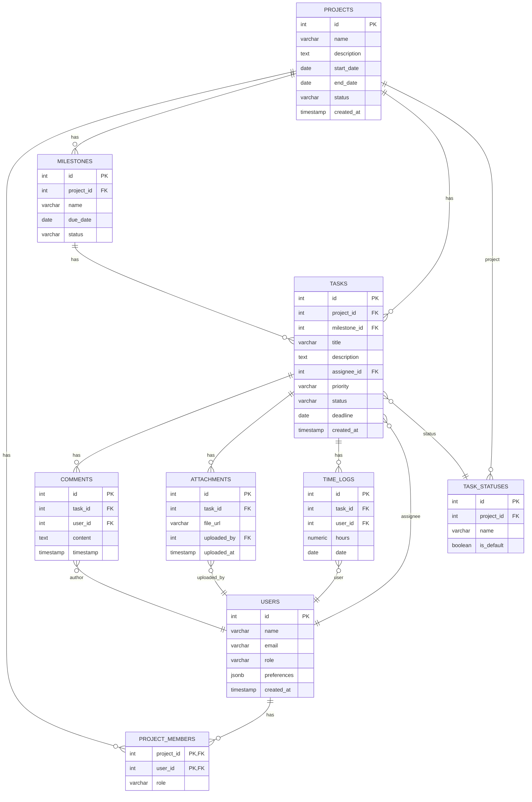

# Entity-Relationship (ER) Diagram

The following ER diagram visualizes the relationships between the main entities in the Project Management Dashboard database schema.

```mermaid
erDiagram
    USERS ||--o{ PROJECT_MEMBERS : "has"
    PROJECTS ||--o{ PROJECT_MEMBERS : "has"
    PROJECTS ||--o{ MILESTONES : "has"
    PROJECTS ||--o{ TASKS : "has"
    MILESTONES ||--o{ TASKS : "has"
    TASKS ||--o{ COMMENTS : "has"
    TASKS ||--o{ ATTACHMENTS : "has"
    TASKS ||--o{ TIME_LOGS : "has"
    TASKS }o--|| USERS : "assignee"
    TASKS }o--|| TASK_STATUSES : "status"
    COMMENTS }o--|| USERS : "author"
    ATTACHMENTS }o--|| USERS : "uploaded_by"
    TIME_LOGS }o--|| USERS : "user"
    TASK_STATUSES }o--|| PROJECTS : "project"

    USERS {
      int id PK
      varchar name
      varchar email
      varchar role
      jsonb preferences
      timestamp created_at
    }
    PROJECTS {
      int id PK
      varchar name
      text description
      date start_date
      date end_date
      varchar status
      timestamp created_at
    }
    PROJECT_MEMBERS {
      int project_id PK, FK
      int user_id PK, FK
      varchar role
    }
    MILESTONES {
      int id PK
      int project_id FK
      varchar name
      date due_date
      varchar status
    }
    TASKS {
      int id PK
      int project_id FK
      int milestone_id FK
      varchar title
      text description
      int assignee_id FK
      varchar priority
      varchar status
      date deadline
      timestamp created_at
    }
    COMMENTS {
      int id PK
      int task_id FK
      int user_id FK
      text content
      timestamp timestamp
    }
    ATTACHMENTS {
      int id PK
      int task_id FK
      varchar file_url
      int uploaded_by FK
      timestamp uploaded_at
    }
    TIME_LOGS {
      int id PK
      int task_id FK
      int user_id FK
      numeric hours
      date date
    }
    TASK_STATUSES {
      int id PK
      int project_id FK
      varchar name
      boolean is_default
    }
```